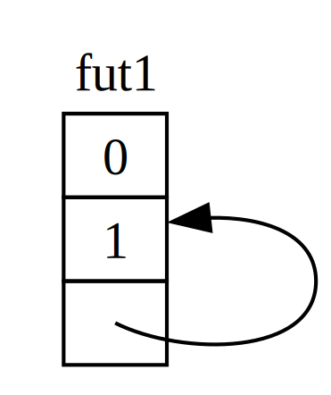

# نگاهی دقیق‌تر به ویژگی‌های غیرهمزمان

در طول این فصل، ما از ویژگی‌های `Future`، `Pin`، `Unpin`، `Stream` و `StreamExt` به روش‌های مختلفی استفاده کرده‌ایم. تا حالا، از ورود به جزئیات نحوه کار آن‌ها یا چگونگی کنار هم قرار گرفتنشان اجتناب کرده‌ایم، که برای بیشتر کارهای روزمره در Rust مشکلی ندارد. اما گاهی اوقات، با موقعیت‌هایی مواجه می‌شوید که نیاز به درک بیشتری از این جزئیات دارید. در این بخش، به اندازه کافی عمیق می‌شویم تا در این سناریوها به شما کمک کنیم، اما همچنان بررسی عمیق‌تر را به مستندات دیگر واگذار می‌کنیم.

## ویژگی Future

بیایید با نگاهی دقیق‌تر به نحوه کار ویژگی `Future` شروع کنیم. اینگونه است که Rust آن را تعریف می‌کند:

```rust
use std::pin::Pin;
use std::task::{Context, Poll};

pub trait Future {
    type Output;

    fn poll(self: Pin<&mut Self>, cx: &mut Context<'_>) -> Poll<Self::Output>;
}
```

این تعریف ویژگی شامل تعدادی نوع جدید و همچنین سینتکسی است که قبلاً ندیده‌ایم، بنابراین بیایید تعریف را قطعه به قطعه بررسی کنیم.

اول، نوع مرتبط `Output` در `Future` مشخص می‌کند که فیوچر به چه چیزی حل می‌شود. این مشابه نوع مرتبط `Item` برای ویژگی `Iterator` است. دوم، `Future` همچنین متد `poll` را دارد که یک ارجاع ویژه `Pin` برای پارامتر `self` و یک ارجاع قابل‌تغییر به نوع `Context` می‌گیرد و یک `Poll<Self::Output>` برمی‌گرداند. در لحظه‌ای درباره `Pin` و `Context` بیشتر صحبت خواهیم کرد. فعلاً، بیایید روی آنچه متد برمی‌گرداند تمرکز کنیم، یعنی نوع `Poll`:

```rust
enum Poll<T> {
    Ready(T),
    Pending,
}
```

این نوع `Poll` مشابه یک `Option` است. یک گونه (variant) دارد که یک مقدار دارد، یعنی `Ready(T)`، و یکی که مقداری ندارد، یعنی `Pending`. اما `Poll` معنای کاملاً متفاوتی از `Option` دارد! گونه `Pending` نشان می‌دهد که فیوچر هنوز کار برای انجام دارد، بنابراین فراخواننده باید بعداً دوباره بررسی کند. گونه `Ready` نشان می‌دهد که فیوچر کار خود را تمام کرده و مقدار `T` در دسترس است.

> **توجه**: با اکثر فیوچرها، فراخواننده نباید پس از اینکه فیوچر `Ready` را برگرداند، دوباره `poll` را فراخوانی کند. بسیاری از فیوچرها اگر پس از آماده شدن دوباره نظرسنجی شوند، پنیک می‌کنند. فیوچرهایی که می‌توانند دوباره به‌صورت امن نظرسنجی شوند، این را به‌صراحت در مستنداتشان ذکر می‌کنند. این مشابه نحوه رفتار `Iterator::next` است.

وقتی کدی می‌بینید که از `await` استفاده می‌کند، Rust در پشت صحنه آن را به کدی که `poll` را فراخوانی می‌کند کامپایل می‌کند. اگر به Listing 17-4 نگاه کنید، جایی که عنوان صفحه را برای یک URL پس از حل شدن چاپ کردیم، Rust آن را به چیزی شبیه (اگرچه نه دقیقاً) این کامپایل می‌کند:

```rust
match page_title(url).poll() {
    Ready(page_title) => match page_title {
        Some(title) => println!("عنوان برای {url} برابر بود با {title}"), // The title for {url} was {title}
        None => println!("{url} عنوانی نداشت"), // {url} had no title
    }
    Pending => {
        // اما اینجا چه باید گذاشت؟
    }
}
```

وقتی فیوچر هنوز `Pending` است، چه باید بکنیم؟ ما به راهی نیاز داریم که دوباره و دوباره و دوباره امتحان کنیم تا بالاخره فیوچر آماده شود. به عبارت دیگر، به یک حلقه نیاز داریم:

```rust
let mut page_title_fut = page_title(url);
loop {
    match page_title_fut.poll() {
        Ready(value) => match page_title {
            Some(title) => println!("عنوان برای {url} برابر بود با {title}"), // The title for {url} was {title}
            None => println!("{url} عنوانی نداشت"), // {url} had no title
        }
        Pending => {
            // ادامه
        }
    }
}
```

اما اگر Rust آن را دقیقاً به این کد کامپایل کند، هر `await` مسدودکننده خواهد بود—دقیقاً برعکس آنچه ما به دنبالش بودیم! در عوض، Rust مطمئن می‌شود که حلقه می‌تواند کنترل را به چیزی واگذار کند که می‌تواند کار روی این فیوچر را متوقف کند تا روی فیوچرهای دیگر کار کند و سپس این یکی را دوباره بررسی کند. همان‌طور که دیدیم، آن چیز یک زمان‌اجرای غیرهمزمان (async runtime) است، و این کار زمان‌بندی و هماهنگی یکی از وظایف اصلی آن است.

اوایل این فصل، درباره انتظار روی `rx.recv` صحبت کردیم. فراخوانی `recv` یک فیوچر برمی‌گرداند، و انتظار فیوچر آن را نظرسنجی می‌کند. اشاره کردیم که یک زمان‌اجرا فیوچر را تا زمانی که آماده باشد با `Some(message)` یا `None` وقتی کانال بسته می‌شود، متوقف می‌کند. با درک عمیق‌تر ما از ویژگی `Future`، و به‌ویژه `Future::poll`، می‌توانیم ببینیم که این چگونه کار می‌کند. زمان‌اجرا می‌داند که فیوچر آماده نیست وقتی `Poll::Pending` را برمی‌گرداند. برعکس، زمان‌اجرا می‌داند که فیوچر آماده است و وقتی `poll` مقدار `Poll::Ready(Some(message))` یا `Poll::Ready(None)` را برمی‌گرداند، آن را پیش می‌برد.

جزئیات دقیق نحوه انجام این کار توسط زمان‌اجرا خارج از حوزه این کتاب است، اما نکته کلیدی این است که مکانیک‌های اساسی فیوچرها را ببینیم: یک زمان‌اجرا هر فیچوری که مسئول آن است را نظرسنجی می‌کند و وقتی هنوز آماده نیست، فیوچر را به خواب می‌برد.

## ویژگی‌های Pin و Unpin

وقتی ایده پین کردن را در Listing 17-16 معرفی کردیم، با یک پیام خطای بسیار پیچیده مواجه شدیم. اینجا بخش مرتبط آن را دوباره می‌بینیم:

```
error[E0277]: `{async block@src/main.rs:10:23: 10:33}` cannot be unpinned
  --> src/main.rs:48:33
   |
48 |         trpl::join_all(futures).await;
   |                                 ^^^^^ the trait `Unpin` is not implemented for `{async block@src/main.rs:10:23: 10:33}`
   |
   = note: consider using the `pin!` macro
           consider using `Box::pin` if you need to access the pinned value outside of the current scope
   = note: required for `Box<{async block@src/main.rs:10:23: 10:33}>` to implement `Future`
note: required by a bound in `futures_util::future::join_all::JoinAll`
  --> file:///home/.cargo/registry/src/index.crates.io-1949cf8c6b5b557f/futures-util-0.3.30/src/future/join_all.rs:29:8
   |
27 | pub struct JoinAll<F>
   |            ------- required by a bound in this struct
28 | where
29 |     F: Future,
   |        ^^^^^^ required by this bound in `JoinAll`
```

این پیام خطا نه تنها به ما می‌گوید که باید مقادیر را پین کنیم، بلکه توضیح می‌دهد که چرا پین کردن لازم است. تابع `trpl::join_all` یک ساختار به نام `JoinAll` برمی‌گرداند. این ساختار روی یک نوع `F` عمومی است که محدود شده تا ویژگی `Future` را پیاده‌سازی کند. انتظار مستقیم یک فیوچر با `await` به‌طور ضمنی فیوچر را پین می‌کند. به همین دلیل است که نیازی به استفاده از `pin!` در هر جایی که می‌خواهیم فیوچرها را انتظار کنیم نداریم.

اما اینجا ما مستقیماً یک فیوچر را انتظار نمی‌کنیم. در عوض، با پاس دادن یک مجموعه از فیوچرها به تابع `join_all`، یک فیوچر جدید، یعنی `JoinAll`، می‌سازیم. امضا برای `join_all` نیاز دارد که نوع‌های آیتم‌ها در مجموعه همگی ویژگی `Future` را پیاده‌سازی کنند، و `Box<T>` فقط در صورتی ویژگی `Future` را پیاده‌سازی می‌کند که `T` که در بر می‌گیرد یک فیوچر باشد که ویژگی `Unpin` را پیاده‌سازی کند.

این خیلی چیزها برای هضم است! برای درک واقعی آن، بیایید کمی عمیق‌تر به نحوه کار واقعی ویژگی `Future`، به‌ویژه در مورد پین کردن، بپردازیم.

دوباره به تعریف ویژگی `Future` نگاه کنید:

```rust
use std::pin::Pin;
use std::task::{Context, Poll};

pub trait Future {
    type Output;

    // متد مورد نیاز
    fn poll(self: Pin<&mut Self>, cx: &mut Context<'_>) -> Poll<Self::Output>;
}
```

پارامتر `cx` و نوع `Context` آن کلید این هستند که چگونه یک زمان‌اجرا واقعاً می‌داند چه زمانی باید هر فیوچر داده‌شده را بررسی کند در حالی که هنوز تنبل است. باز هم، جزئیات نحوه کار آن خارج از حوزه این فصل است، و شما معمولاً فقط وقتی یک پیاده‌سازی سفارشی `Future` می‌نویسید نیاز به فکر کردن درباره این دارید. ما به جای آن روی نوع `self` تمرکز می‌کنیم، زیرا این اولین باری است که متدی را می‌بینیم که `self` یک حاشیه‌نویسی نوع دارد. یک حاشیه‌نویسی نوع برای `self` مانند حاشیه‌نویسی‌های نوع برای سایر پارامترهای تابع کار می‌کند، اما با دو تفاوت کلیدی:

1. به Rust می‌گوید که `self` باید چه نوع باشد تا متد فراخوانی شود.
2. نمی‌تواند هر نوع دلخواهی باشد. محدود است به نوع‌ای که متد روی آن پیاده‌سازی شده، یک ارجاع یا اشاره‌گر هوشمند به آن نوع، یا یک `Pin` که یک ارجاع به آن نوع را می‌پیچد.

ما در فصل هجدهم بیشتر درباره این سینتکس خواهیم دید. فعلاً، کافی است بدانیم که اگر بخواهیم یک فیوچر را نظرسنجی کنیم تا بررسی کنیم که آیا `Pending` است یا `Ready(Output)`، به یک ارجاع قابل‌تغییر پیچیده‌شده در `Pin` به نوع نیاز داریم.

`Pin` یک بسته‌بندی برای نوع‌های شبیه به اشاره‌گر مانند `&`، `&mut`، `Box` و `Rc` است. (از نظر فنی، `Pin` با نوع‌هایی کار می‌کند که ویژگی‌های `Deref` یا `DerefMut` را پیاده‌سازی می‌کنند، اما این عملاً معادل کار فقط با اشاره‌گرها است.) `Pin` خود یک اشاره‌گر نیست و هیچ رفتار خاص خود مانند `Rc` و `Arc` با شمارش ارجاع ندارد؛ صرفاً ابزاری است که کامپایلر می‌تواند از آن برای اعمال محدودیت‌ها روی استفاده از اشاره‌گر استفاده کند.

به یاد آوردن اینکه `await` به صورت فراخوانی‌های `poll` پیاده‌سازی شده است، شروع به توضیح پیام خطایی که قبلاً دیدیم می‌کند، اما آن در مورد `Unpin` بود، نه `Pin`. پس دقیقاً `Pin` چگونه به `Unpin` مربوط می‌شود، و چرا `Future` نیاز دارد که `self` در یک نوع `Pin` باشد تا `poll` را فراخوانی کند؟

به یاد بیاورید که در اوایل این فصل، یک سری نقاط `await` در یک فیوچر به یک ماشین حالت (state machine) کامپایل می‌شوند، و کامپایلر مطمئن می‌شود که آن ماشین حالت تمام قوانین عادی Rust در مورد ایمنی، از جمله قرض گرفتن و مالکیت، را دنبال می‌کند. برای اینکه این کار کند، Rust بررسی می‌کند که چه داده‌هایی بین یک نقطه `await` و یا نقطه `await` بعدی یا پایان بلوک `async` مورد نیاز است. سپس یک گونه متناظر در ماشین حالت کامپایل‌شده ایجاد می‌کند. هر گونه دسترسی‌ای که به داده‌هایی که در آن بخش از کد منبع استفاده خواهد شد نیاز دارد را دریافت می‌کند، چه با گرفتن مالکیت آن داده یا با گرفتن یک ارجاع قابل‌تغییر یا غیرقابل‌تغییر به آن.

تا اینجا خوب است: اگر چیزی را درباره مالکیت یا ارجاع‌ها در یک بلوک `async` اشتباه کنیم، بررسی‌کننده قرض (borrow checker) به ما خواهد گفت. وقتی بخواهیم فیچوری که به آن بلوک مربوط است را جابه‌جا کنیم—مثلاً با قرار دادن آن در یک `Vec` برای پاس دادن به `join_all`—اوضاع پیچیده‌تر می‌شود.

وقتی یک فیوچر را جابه‌جا می‌کنیم—چه با فشار دادن آن به یک ساختار داده برای استفاده به‌عنوان یک تکرارکننده با `join_all` یا با بازگرداندن آن از یک تابع—در واقع به این معناست که ماشین حالتی که Rust برای ما ایجاد کرده را جابه‌جا می‌کنیم. و برخلاف اکثر نوع‌های دیگر در Rust، فیوچرهایی که Rust برای بلوک‌های `async` ایجاد می‌کند می‌توانند در فیلدهای هر گونه داده‌شده ارجاع‌هایی به خودشان داشته باشند، همان‌طور که در تصویر ساده‌شده در شکل 17-4 نشان داده شده است.



به‌طور پیش‌فرض، هر شیئی که ارجاعی به خودش دارد برای جابه‌جایی ناامن است، زیرا ارجاع‌ها همیشه به آدرس حافظه واقعی چیزی که به آن اشاره می‌کنند اشاره دارند (شکل 17-5 را ببینید). اگر خود ساختار داده را جابه‌جا کنید، آن ارجاع‌های داخلی به مکان قدیمی اشاره خواهند کرد. اما آن مکان حافظه حالا نامعتبر است. برای یک چیز، مقدار آن وقتی تغییراتی در ساختار داده ایجاد می‌کنید به‌روزرسانی نخواهد شد. برای چیز دیگر—مهم‌تر—کامپیوتر حالا آزاد است که آن حافظه را برای مقاصد دیگر استفاده کند! ممکن است بعداً داده‌های کاملاً غیرمرتبطی بخوانید.


از نظر تئوری، کامپایلر Rust می‌توانست سعی کند هر ارجاع به یک شیء را هر زمان که جابه‌جا می‌شود به‌روزرسانی کند، اما این می‌توانست سربار عملکرد زیادی اضافه کند، به‌ویژه اگر شبکه‌ای از ارجاع‌ها نیاز به به‌روزرسانی داشته باشد. اگر به جای آن بتوانیم مطمئن شویم که ساختار داده مورد نظر در حافظه جابه‌جا نمی‌شود، نیازی به به‌روزرسانی هیچ ارجاعی نخواهیم داشت. این دقیقاً همان چیزی است که بررسی‌کننده قرض Rust نیاز دارد: در کد امن، از جابه‌جایی هر آیتمی که ارجاع فعالی به آن وجود دارد جلوگیری می‌کند.

`Pin` بر این اساس ساخته شده تا دقیقاً تضمینی که نیاز داریم را به ما بدهد. وقتی مقداری را با پیچیدن یک اشاره‌گر به آن مقدار در `Pin` پین می‌کنیم، دیگر نمی‌تواند جابه‌جا شود. بنابراین، اگر `Pin<Box<SomeType>>` داشته باشید، در واقع مقدار `SomeType` را پین می‌کنید، نه اشاره‌گر `Box`. شکل 17-6 این فرآیند را نشان می‌دهد.


در واقع، اشاره‌گر `Box` هنوز می‌تواند آزادانه جابه‌جا شود. به یاد داشته باشید: ما به این اهمیت می‌دهیم که مطمئن شویم داده‌ای که در نهایت به آن اشاره می‌شود در جای خود باقی می‌ماند. اگر یک اشاره‌گر جابه‌جا شود، اما داده‌ای که به آن اشاره می‌کند در همان مکان باشد، همان‌طور که در شکل 17-7 نشان داده شده، هیچ مشکل بالقوه‌ای وجود ندارد. به‌عنوان یک تمرین مستقل، به مستندات نوع‌ها و همچنین ماژول `std::pin` نگاه کنید و سعی کنید بفهمید چگونه این کار را با یک `Pin` که یک `Box` را می‌پیچد انجام می‌دهید. نکته کلیدی این است که خود نوع خود-ارجاعی نمی‌تواند جابه‌جا شود، زیرا هنوز پین شده است.


با این حال، اکثر نوع‌ها کاملاً برای جابه‌جایی امن هستند، حتی اگر در یک بسته‌بندی `Pin` باشند. فقط وقتی آیتم‌ها ارجاع‌های داخلی دارند نیاز به فکر کردن درباره پین کردن داریم. مقادیر اولیه مانند اعداد و بولین‌ها امن هستند چون очевидно هیچ ارجاع داخلی ندارند. همچنین اکثر نوع‌هایی که معمولاً در Rust با آن‌ها کار می‌کنید این‌گونه هستند. برای مثال، می‌توانید یک `Vec` را بدون نگرانی جابه‌جا کنید. با توجه به آنچه تا حالا دیده‌ایم، اگر یک `Pin<Vec<String>>` داشته باشید، باید همه چیز را از طریق APIهای امن اما محدود ارائه‌شده توسط `Pin` انجام دهید، حتی اگر یک `Vec<String>` همیشه برای جابه‌جایی امن باشد اگر هیچ ارجاع دیگری به آن وجود نداشته باشد. ما به راهی نیاز داریم که به کامپایلر بگوییم در چنین مواردی جابه‌جایی آیتم‌ها اشکالی ندارد—و اینجا است که `Unpin` وارد بازی می‌شود.

`Unpin` یک ویژگی نشانگر (marker trait) است، مشابه ویژگی‌های `Send` و `Sync` که در فصل شانزدهم دیدیم، و بنابراین هیچ عملکردی از خودش ندارد. ویژگی‌های نشانگر فقط برای این وجود دارند که به کامپایلر بگویند استفاده از نوع‌ای که یک ویژگی داده‌شده را در یک زمینه خاص پیاده‌سازی می‌کند امن است. `Unpin` به کامپایلر اطلاع می‌دهد که یک نوع داده‌شده نیازی به حفظ هیچ تضمینی درباره اینکه آیا مقدار مورد نظر می‌تواند به‌صورت امن جابه‌جا شود ندارد.

مانند `Send` و `Sync`، کامپایلر به‌طور خودکار `Unpin` را برای همه نوع‌هایی که می‌تواند ثابت کند امن هستند پیاده‌سازی می‌کند. یک مورد خاص، باز هم مشابه `Send` و `Sync`، زمانی است که `Unpin` برای یک نوع پیاده‌سازی نشده است. نشانه‌گذاری برای این حالت `impl !Unpin for SomeType` است، که در آن `SomeType` نام نوع‌ای است که برای امن بودن هر زمان که یک اشاره‌گر به آن نوع در یک `Pin` استفاده می‌شود، نیاز به حفظ آن تضمین‌ها دارد.

به عبارت دیگر، دو چیز را درباره رابطه بین `Pin` و `Unpin` باید در نظر داشت. اول، `Unpin` مورد «عادی» است، و `!Unpin` مورد خاص است. دوم، اینکه یک نوع `Unpin` یا `!Unpin` را پیاده‌سازی می‌کند فقط وقتی اهمیت دارد که از یک اشاره‌گر پین‌شده به آن نوع مانند `Pin<&mut SomeType>` استفاده می‌کنید.

برای ملموس کردن این، به یک `String` فکر کنید: آن یک طول و کاراکترهای یونیکد که آن را تشکیل می‌دهند دارد. می‌توانیم یک `String` را در `Pin` بپیچیم، همان‌طور که در شکل 17-8 نشان داده شده است. با این حال، `String` به‌طور خودکار `Unpin` را پیاده‌سازی می‌کند، همان‌طور که اکثر نوع‌های دیگر در Rust.


در نتیجه، می‌توانیم کارهایی انجام دهیم که اگر `String` به جای آن `!Unpin` را پیاده‌سازی می‌کرد غیرقانونی می‌بود، مانند جایگزین کردن یک رشته با رشته دیگر در همان مکان دقیق در حافظه، همان‌طور که در شکل 17-9 نشان داده شده است. این قرارداد `Pin` را نقض نمی‌کند، زیرا `String` هیچ ارجاع داخلی‌ای ندارد که جابه‌جایی آن را ناامن کند! این دقیقاً همان دلیلی است که `Unpin` را به جای `!Unpin` پیاده‌سازی می‌کند.


حالا به اندازه کافی می‌دانیم تا خطاهایی که برای فراخوانی `join_all` در Listing 17-17 گزارش شده بودند را درک کنیم. ما ابتدا سعی کردیم فیوچرهای تولیدشده توسط بلوک‌های `async` را به یک `Vec<Box<dyn Future<Output = ()>>>` جابه‌جا کنیم، اما همان‌طور که دیدیم، آن فیوچرها ممکن است ارجاع‌های داخلی داشته باشند، بنابراین `Unpin` را پیاده‌سازی نمی‌کنند. آن‌ها نیاز به پین شدن دارند، و سپس می‌توانیم نوع `Pin` را به `Vec` پاس دهیم، با اطمینان اینکه داده‌های زیربنایی در فیوچرها جابه‌جا نخواهند شد.

`Pin` و `Unpin` بیشتر برای ساخت کتابخانه‌های سطح پایین یا وقتی خودتان یک زمان‌اجرا می‌سازید مهم هستند، نه برای کد روزمره Rust. اما وقتی این ویژگی‌ها را در پیام‌های خطا می‌بینید، حالا ایده بهتری خواهید داشت که چگونه کد خود را اصلاح کنید!

> **توجه**: این ترکیب `Pin` و `Unpin` امکان پیاده‌سازی ایمن کلاسی از نوع‌های پیچیده در Rust را فراهم می‌کند که در غیر این صورت به دلیل خود-ارجاعی بودنشان چالش‌برانگیز می‌بودند. نوع‌هایی که نیاز به `Pin` دارند امروزه بیشتر در Rust غیرهمزمان ظاهر می‌شوند، اما هر از گاهی ممکن است در زمینه‌های دیگر هم آن‌ها را ببینید.

جزئیات نحوه کار `Pin` و `Unpin`، و قوانینی که باید رعایت کنند، به‌طور گسترده در مستندات API برای `std::pin` پوشش داده شده است، بنابراین اگر علاقه‌مند به یادگیری بیشتر هستید، آنجا نقطه شروع عالی‌ای است.

اگر می‌خواهید درک کنید که چگونه چیزها در زیرساخت با جزئیات بیشتری کار می‌کنند، به فصل‌های دوم و چهارم کتاب *Asynchronous Programming in Rust* نگاه کنید.

## ویژگی Stream

حالا که درک عمیق‌تری از ویژگی‌های `Future`، `Pin` و `Unpin` دارید، می‌توانیم توجه خود را به ویژگی `Stream` معطوف کنیم. همان‌طور که در اوایل این فصل آموختید، استریم‌ها مشابه تکرارکننده‌های غیرهمزمان هستند. اما برخلاف `Iterator` و `Future`، تا زمان نگارش این متن، `Stream` هیچ تعریفی در کتابخانه استاندارد ندارد، اما یک تعریف بسیار رایج از کریت `futures` وجود دارد که در سراسر اکوسیستم استفاده می‌شود.

بیایید تعریف‌های ویژگی‌های `Iterator` و `Future` را قبل از اینکه ببینیم چگونه یک ویژگی `Stream` ممکن است آن‌ها را با هم ادغام کند مرور کنیم. از `Iterator`، ایده یک دنباله را داریم: متد `next` آن یک `Option<Self::Item>` ارائه می‌دهد. از `Future`، ایده آمادگی در طول زمان را داریم: متد `poll` آن یک `Poll<Self::Output>` ارائه می‌دهد. برای نمایش یک دنباله از آیتم‌هایی که در طول زمان آماده می‌شوند، یک ویژگی `Stream` تعریف می‌کنیم که این ویژگی‌ها را با هم ترکیب می‌کند:

```rust
use std::pin::Pin;
use std::task::{Context, Poll};

trait Stream {
    type Item;

    fn poll_next(
        self: Pin<&mut Self>,
        cx: &mut Context<'_>
    ) -> Poll<Option<Self::Item>>;
}
```

ویژگی `Stream` یک نوع مرتبط به نام `Item` برای نوع آیتم‌های تولیدشده توسط استریم تعریف می‌کند. این مشابه `Iterator` است، که ممکن است صفر تا تعداد زیادی آیتم داشته باشد، و برخلاف `Future` است، که همیشه یک `Output` واحد دارد، حتی اگر نوع واحد `()` باشد.

`Stream` همچنین متدی برای دریافت آن آیتم‌ها تعریف می‌کند. ما آن را `poll_next` می‌نامیم، تا مشخص شود که به همان روش `Future::poll` نظرسنجی می‌کند و به همان روش `Iterator::next` دنباله‌ای از آیتم‌ها تولید می‌کند. نوع بازگشتی آن `Poll` را با `Option` ترکیب می‌کند. نوع بیرونی `Poll` است، زیرا باید برای آمادگی بررسی شود، همان‌طور که یک فیوچر انجام می‌دهد. نوع درونی `Option` است، زیرا باید سیگنال دهد که آیا پیام‌های بیشتری وجود دارد، همان‌طور که یک تکرارکننده انجام می‌دهد.

چیزی بسیار مشابه این تعریف احتمالاً در نهایت بخشی از کتابخانه استاندارد Rust خواهد شد. در حال حاضر، بخشی از ابزارهای اکثر زمان‌اجراها است، بنابراین می‌توانید به آن اعتماد کنید، و همه چیزهایی که در ادامه پوشش می‌دهیم باید به‌طور کلی اعمال شود!

اما در مثالی که در بخش استریم‌ها دیدیم، ما از `poll_next` یا `Stream` استفاده نکردیم، بلکه از `next` و `StreamExt` استفاده کردیم. البته می‌توانستیم مستقیماً با API `poll_next` کار کنیم با نوشتن دستی ماشین‌های حالت `Stream` خودمان، همان‌طور که می‌توانستیم با فیوچرها مستقیماً از طریق متد `poll` آن‌ها کار کنیم. اما استفاده از `await` خیلی بهتر است، و ویژگی `StreamExt` متد `next` را فراهم می‌کند تا بتوانیم دقیقاً همین کار را انجام دهیم:

```rust
trait StreamExt: Stream {
    async fn next(&mut self) -> Option<Self::Item>
    where
        Self: Unpin;

    // سایر متدها...
}
```

> **توجه**: تعریف واقعی که قبلاً در این فصل استفاده کردیم کمی متفاوت از این به نظر می‌رسد، زیرا از نسخه‌های Rust پشتیبانی می‌کند که هنوز از توابع غیرهمزمان در ویژگی‌ها پشتیبانی نمی‌کردند. در نتیجه، به این شکل است:

```rust
fn next(&mut self) -> Next<'_, Self> where Self: Unpin;
```

آن نوع `Next` یک ساختار است که `Future` را پیاده‌سازی می‌کند و به ما امکان می‌دهد طول عمر ارجاع به `self` را با `Next<'_, Self>` نام‌گذاری کنیم، تا `await` بتواند با این متد کار کند.

ویژگی `StreamExt` همچنین خانه همه متدهای جالبی است که برای استفاده با استریم‌ها در دسترس هستند. `StreamExt` به‌طور خودکار برای هر نوع‌ای که `Stream` را پیاده‌سازی می‌کند پیاده‌سازی می‌شود، اما این ویژگی‌ها به‌طور جداگانه تعریف شده‌اند تا جامعه بتواند روی APIهای راحتی تکرار کند بدون تأثیر بر ویژگی بنیادی.

در نسخه `StreamExt` که در کریت `trpl` استفاده شده، این ویژگی نه تنها متد `next` را تعریف می‌کند بلکه یک پیاده‌سازی پیش‌فرض از `next` را نیز ارائه می‌دهد که جزئیات فراخوانی `Stream::poll_next` را به‌درستی مدیریت می‌کند. این به این معناست که حتی وقتی نیاز به نوشتن نوع داده استریم خودتان دارید، فقط باید `Stream` را پیاده‌سازی کنید، و سپس هر کسی که از نوع داده شما استفاده می‌کند می‌تواند به‌طور خودکار از `StreamExt` و متدهای آن با آن استفاده کند.

این تمام چیزی است که برای جزئیات سطح پایین این ویژگی‌ها پوشش خواهیم داد. برای جمع‌بندی، بیایید در نظر بگیریم که چگونه فیوچرها (از جمله استریم‌ها)، وظایف (tasks)، و نخ‌ها (threads) همگی با هم هماهنگ می‌شوند!